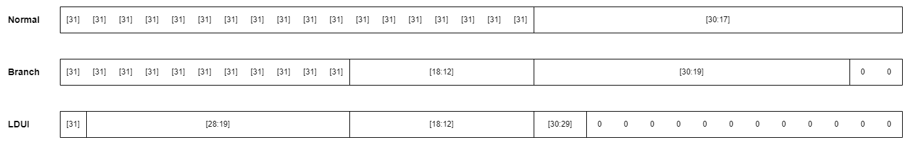

## Registers

| Name  | Alias  |  Index  | Saver  |
| ----- | ------ | ------- | ------ |
| `pc`  | -      | -       | -      |
| -     |        |         |        |
| `r0`  | `zero` | `00000` | -      |
| `r1`  | `ra`   | `00001` | caller |
| `r2`  | `sp`   | `00010` | callee |
| `r3`  | `a0`   | `00011` | caller |
| `r4`  | `a1`   | `00100` | caller |
| `r5`  | `a2`   | `00101` | caller |
| `r6`  | `a3`   | `00110` | caller |
| `r7`  | `a4`   | `00111` | caller |
| `r8`  | `a5`   | `01000` | caller |
| `r9`  | `a6`   | `01001` | caller |
| `r10` | `a7`   | `01010` | caller |
| `r11` | `t0`   | `01011` | caller |
| `r12` | `t1`   | `01100` | caller |
| `r13` | `t2`   | `01101` | caller |
| `r14` | `t3`   | `01110` | caller |
| `r15` | `t4`   | `01111` | caller |
| `r16` | `t5`   | `10000` | caller |
| `r17` | `t6`   | `10001` | caller |
| `r18` | `t7`   | `10010` | caller |
| `r19` | `s0`   | `10011` | callee |
| `r20` | `s1`   | `10100` | callee |
| `r21` | `s2`   | `10101` | callee |
| `r22` | `s3`   | `10110` | callee |
| `r23` | `s4`   | `10111` | callee |
| `r24` | `s5`   | `11000` | callee |
| `r25` | `s6`   | `11001` | callee |
| `r26` | `s7`   | `11010` | callee |
| `r27` | `s8`   | `11011` | callee |
| `r28` | `s9`   | `11100` | callee |
| `r29` | `s10`  | `11101` | callee |
| `r30` | `s11`  | `11110` | callee |
| `r31` | `s12`  | `11111` | callee |

## Flags
| Name | Description |
| ---- | ----------- |
| `C`  | Carry       |
| `Z`  | Zero        |
| `S`  | Sign        |
| `O`  | Overflow    |
| `K`  | Kernel mode |

## Instructions

| Mnemonic + operands | Full name                                  | Bit pattern                             | Affected flags | Operation |
| ------------------- | ------------------------------------------ | --------------------------------------- | -------------- | --------- |
| `NOP`               | No operation                               | `----------_-----_-----_-----_0-00_000` | `-`            | -         |
| `BRK`               | Break                                      | `----------_-----_-----_-----_0-01_000` | `-`            | Pauses emulation (behaves like NOP in hardware) |
| `HLT`               | Halt                                       | `----------_-----_-----_-----_0-10_000` | `-`            | Stops emulation gracefully (behaves like NOP in hardware) |
| `ERR`               | Error                                      | `----------_-----_-----_-----_0-11_000` | `-`            | Stops emulation with an error (behaves like NOP in hardware) |
| -                   |                                            |                                         |                |           |
| `SYS`               | System call                                | `----------_-----_-----_-----_1--0_000` | `K`            | `K = 1, pc = 0x00007FF0` |
| `CLRK`              | Clear K flag                               | `----------_-----_-----_-----_1--1_000` | `K`            | `K = 0` |
| -                   |                                            |                                         |                |           |
| `ADD  d, l, r`      | Add                                        | `----------_rrrrr_lllll_ddddd_0000_001` | `C, Z, S, O`   | `d = l + r` |
| `ADDC d, l, r`      | Add with carry                             | `----------_rrrrr_lllll_ddddd_0001_001` | `C, Z, S, O`   | `d = l + r + C` |
| `SUB  d, l, r`      | Subtract                                   | `----------_rrrrr_lllll_ddddd_0010_001` | `C, Z, S, O`   | `d = l - r` |
| `SUBB d, l, r`      | Subtract with Borrow                       | `----------_rrrrr_lllll_ddddd_0011_001` | `C, Z, S, O`   | `d = l - r - 1 + C` |
| `AND  d, l, r`      | Bitwise AND                                | `----------_rrrrr_lllll_ddddd_0100_001` | `Z`            | `d = l & r` |
| `OR   d, l, r`      | Bitwise OR                                 | `----------_rrrrr_lllll_ddddd_0101_001` | `Z`            | `d = l \| r` |
| `XOR  d, l, r`      | Bitwise XOR                                | `----------_rrrrr_lllll_ddddd_0110_001` | `Z`            | `d = l ^ r` |
| `SHL  d, l, r`      | Shift left                                 | `----------_rrrrr_lllll_ddddd_0111_001` | `Z`            | `d = l << r` |
| `LSR  d, l, r`      | Logical shift right                        | `----------_rrrrr_lllll_ddddd_1000_001` | `Z`            | `d = l >> r` |
| `ASR  d, l, r`      | Arithmetic shift right                     | `----------_rrrrr_lllll_ddddd_1001_001` | `Z`            | `d = l >>> r` |
| `MUL  d, l, r`      | Multiply                                   | `----------_rrrrr_lllll_ddddd_1010_001` | `Z`            | `d = (l * r)[31..0]` |
| -                   |                                            |                                         |                |           |
| `ADD  d, l, v`      | Add                                        | `vvvvvvvvvv_vvvvv_lllll_ddddd_0000_010` | `C, Z, S, O`   | `d = l + v` |
| `ADDC d, l, v`      | Add with carry                             | `vvvvvvvvvv_vvvvv_lllll_ddddd_0001_010` | `C, Z, S, O`   | `d = l + v + C` |
| `SUB  d, l, v`      | Subtract                                   | `vvvvvvvvvv_vvvvv_lllll_ddddd_0010_010` | `C, Z, S, O`   | `d = l - v` |
| `SUBB d, l, v`      | Subtract with Borrow                       | `vvvvvvvvvv_vvvvv_lllll_ddddd_0011_010` | `C, Z, S, O`   | `d = l - v - 1 + C` |
| `AND  d, l, v`      | Bitwise AND                                | `vvvvvvvvvv_vvvvv_lllll_ddddd_0100_010` | `Z`            | `d = l & v` |
| `OR   d, l, v`      | Bitwise OR                                 | `vvvvvvvvvv_vvvvv_lllll_ddddd_0101_010` | `Z`            | `d = l \| v` |
| `XOR  d, l, v`      | Bitwise XOR                                | `vvvvvvvvvv_vvvvv_lllll_ddddd_0110_010` | `Z`            | `d = l ^ v` |
| `SHL  d, l, v`      | Shift left                                 | `vvvvvvvvvv_vvvvv_lllll_ddddd_0111_010` | `Z`            | `d = l << v` |
| `LSR  d, l, v`      | Logical shift right                        | `vvvvvvvvvv_vvvvv_lllll_ddddd_1000_010` | `Z`            | `d = l >> v` |
| `ASR  d, l, v`      | Arithmetic shift right                     | `vvvvvvvvvv_vvvvv_lllll_ddddd_1001_010` | `Z`            | `d = l >>> v` |
| `MUL  d, l, v`      | Multiply                                   | `vvvvvvvvvv_vvvvv_lllll_ddddd_1010_010` | `Z`            | `d = (l * v)[31..0]` |
| -                   |                                            |                                         |                |           |
| `LD    d, [s, v]`   | Load 32bit                                 | `vvvvvvvvvv_vvvvv_sssss_ddddd_0-00_011` | `-`            | `d = mem[s + v]` |
| `LD8   d, [s, v]`   | Load 8bit                                  | `vvvvvvvvvv_vvvvv_sssss_ddddd_0001_011` | `-`            | `d = (u8)mem[s + v]` |
| `LD8S  d, [s, v]`   | Load 8bit signed                           | `vvvvvvvvvv_vvvvv_sssss_ddddd_0101_011` | `-`            | `d = (s8)mem[s + v]` |
| `LD16  d, [s, v]`   | Load 16bit                                 | `vvvvvvvvvv_vvvvv_sssss_ddddd_0010_011` | `-`            | `d = (u16)mem[s + v]` |
| `LD16S d, [s, v]`   | Load 16bit signed                          | `vvvvvvvvvv_vvvvv_sssss_ddddd_0110_011` | `-`            | `d = (s16)mem[s + v]` |
| `IN    d, [s, v]`   | Read from IO                               | `vvvvvvvvvv_vvvvv_sssss_ddddd_0-11_011` | `-`            | `d = io[s + v]` |
| -                   |                                            |                                         |                |           |
| `ST   [d, v], s`    | Store 32bit                                | `vvvvvvvvvv_vvvvv_ddddd_sssss_1-00_011` | `-`            | `mem[d + v] = s` |
| `ST8  [d, v], s`    | Store 8bit                                 | `vvvvvvvvvv_vvvvv_ddddd_sssss_1-01_011` | `-`            | `mem[d + v] = (i8)s` |
| `ST16 [d, v], s`    | Store 16bit                                | `vvvvvvvvvv_vvvvv_ddddd_sssss_1-10_011` | `-`            | `mem[d + v] = (i16)s` |
| `OUT  [d, v], s`    | Write to IO                                | `vvvvvvvvvv_vvvvv_ddddd_sssss_1-11_011` | `-`            | `io[d + v] = s` |
| -                   |                                            |                                         |                |           |
| `JMP s, v`          | Jump absolute to register                  | `vvvvvvvvvv_vvvvv_sssss_-----_00--_100` | `-`            | `pc = s + v` |
| -                   |                                            |                                         |                |           |
| `LINK d, v`         | Add immediate to PC                        | `vvvvvvvvvv_vvvvv_-----_ddddd_01--_100` | `-`            | `d = pc + v` |
| -                   |                                            |                                         |                |           |
| `LDUI    d, v`      | Load upper immediate                       | `vvvvvvvvvv_vvvvv_vvvvv_ddddd_10-0_100` | `-`            | `d = v` |
| `ADDPCUI d, v`      | Add upper immediate to PC                  | `vvvvvvvvvv_vvvvv_vvvvv_ddddd_10-1_100` | `-`            | `d = pc + v` |
| -                   |                                            |                                         |                |           |
| `BR.C    v`         | Branch relative if carry                   | `vvvvvvvvvv_vvvvv_vvvvv_-----_0001_101` | `-`            | `if C then pc += v` |
| `BR.Z    v`         | Branch relative if zero                    | `vvvvvvvvvv_vvvvv_vvvvv_-----_0010_101` | `-`            | `if Z then pc += v` |
| `BR.S    v`         | Branch relative if negative                | `vvvvvvvvvv_vvvvv_vvvvv_-----_0011_101` | `-`            | `if S then pc += v` |
| `BR.O    v`         | Branch relative if overflow                | `vvvvvvvvvv_vvvvv_vvvvv_-----_0100_101` | `-`            | `if O then pc += v` |
| `BR.NC   v`         | Branch relative if not carry               | `vvvvvvvvvv_vvvvv_vvvvv_-----_0101_101` | `-`            | `if !C then pc += v` |
| `BR.NZ   v`         | Branch relative if not zero                | `vvvvvvvvvv_vvvvv_vvvvv_-----_0110_101` | `-`            | `if !Z then pc += v` |
| `BR.NS   v`         | Branch relative if not negative            | `vvvvvvvvvv_vvvvv_vvvvv_-----_0111_101` | `-`            | `if !S then pc += v` |
| `BR.NO   v`         | Branch relative if not overflow            | `vvvvvvvvvv_vvvvv_vvvvv_-----_1000_101` | `-`            | `if !O then pc += v` |
| `BR.U.LE v`         | Branch relative if unsigned less or equal  | `vvvvvvvvvv_vvvvv_vvvvv_-----_1001_101` | `-`            | `if !C \|\| Z then pc += v` |
| `BR.U.G  v`         | Branch relative if unsigned greater        | `vvvvvvvvvv_vvvvv_vvvvv_-----_1010_101` | `-`            | `if C && !Z then pc += v` |
| `BR.S.L  v`         | Branch relative if signed less             | `vvvvvvvvvv_vvvvv_vvvvv_-----_1011_101` | `-`            | `if S != O then pc += v` |
| `BR.S.GE v`         | Branch relative if signed greater or equal | `vvvvvvvvvv_vvvvv_vvvvv_-----_1100_101` | `-`            | `if S == O then pc += v` |
| `BR.S.LE v`         | Branch relative if signed less or equal    | `vvvvvvvvvv_vvvvv_vvvvv_-----_1101_101` | `-`            | `if Z \|\| (S != O) then pc += v` |
| `BR.S.G  v`         | Branch relative if signed greater          | `vvvvvvvvvv_vvvvv_vvvvv_-----_1110_101` | `-`            | `if !Z && (S == O) then pc += v` |
| `JR      v`         | Jump relative                              | `vvvvvvvvvv_vvvvv_vvvvv_-----_1111_101` | `-`            | `pc += v` |
| -                   |                                            |                                         |                |           |
| `MV.C    d, l, r`   | Move if carry                              | `----------_rrrrr_lllll_ddddd_0001_110` | `-`            | `if C then d = r else d = l` |
| `MV.Z    d, l, r`   | Move if zero                               | `----------_rrrrr_lllll_ddddd_0010_110` | `-`            | `if Z then d = r else d = l` |
| `MV.S    d, l, r`   | Move if negative                           | `----------_rrrrr_lllll_ddddd_0011_110` | `-`            | `if S then d = r else d = l` |
| `MV.O    d, l, r`   | Move if overflow                           | `----------_rrrrr_lllll_ddddd_0100_110` | `-`            | `if O then d = r else d = l` |
| `MV.NC   d, l, r`   | Move if not carry                          | `----------_rrrrr_lllll_ddddd_0101_110` | `-`            | `if !C then d = r else d = l` |
| `MV.NZ   d, l, r`   | Move if not zero                           | `----------_rrrrr_lllll_ddddd_0110_110` | `-`            | `if !Z then d = r else d = l` |
| `MV.NS   d, l, r`   | Move if not negative                       | `----------_rrrrr_lllll_ddddd_0111_110` | `-`            | `if !S then d = r else d = l` |
| `MV.NO   d, l, r`   | Move if not overflow                       | `----------_rrrrr_lllll_ddddd_1000_110` | `-`            | `if !O then d = r else d = l` |
| `MV.U.LE d, l, r`   | Move if unsigned less or equal             | `----------_rrrrr_lllll_ddddd_1001_110` | `-`            | `if !C \|\| Z then d = r else d = l` |
| `MV.U.G  d, l, r`   | Move if unsigned greater                   | `----------_rrrrr_lllll_ddddd_1010_110` | `-`            | `if C && !Z then d = r else d = l` |
| `MV.S.L  d, l, r`   | Move if signed less                        | `----------_rrrrr_lllll_ddddd_1011_110` | `-`            | `if S != O then d = r else d = l` |
| `MV.S.GE d, l, r`   | Move if signed greater or equal            | `----------_rrrrr_lllll_ddddd_1100_110` | `-`            | `if S == O then d = r else d = l` |
| `MV.S.LE d, l, r`   | Move if signed less or equal               | `----------_rrrrr_lllll_ddddd_1101_110` | `-`            | `if Z \|\| (S != O) then d = r else d = l` |
| `MV.S.G  d, l, r`   | Move if signed greater                     | `----------_rrrrr_lllll_ddddd_1110_110` | `-`            | `if !Z && (S == O) then d = r else d = l` |
| `MOV     d, r`      | Move                                       | `----------_rrrrr_-----_ddddd_1111_110` | `-`            | `d = r` |
| -                   |                                            |                                         |                |           |
| `MV.C    d, l, v`   | Move if carry                              | `vvvvvvvvvv_vvvvv_lllll_ddddd_0001_111` | `-`            | `if C then d = v else d = l` |
| `MV.Z    d, l, v`   | Move if zero                               | `vvvvvvvvvv_vvvvv_lllll_ddddd_0010_111` | `-`            | `if Z then d = v else d = l` |
| `MV.S    d, l, v`   | Move if negative                           | `vvvvvvvvvv_vvvvv_lllll_ddddd_0011_111` | `-`            | `if S then d = v else d = l` |
| `MV.O    d, l, v`   | Move if overflow                           | `vvvvvvvvvv_vvvvv_lllll_ddddd_0100_111` | `-`            | `if O then d = v else d = l` |
| `MV.NC   d, l, v`   | Move if not carry                          | `vvvvvvvvvv_vvvvv_lllll_ddddd_0101_111` | `-`            | `if !C then d = v else d = l` |
| `MV.NZ   d, l, v`   | Move if not zero                           | `vvvvvvvvvv_vvvvv_lllll_ddddd_0110_111` | `-`            | `if !Z then d = v else d = l` |
| `MV.NS   d, l, v`   | Move if not negative                       | `vvvvvvvvvv_vvvvv_lllll_ddddd_0111_111` | `-`            | `if !S then d = v else d = l` |
| `MV.NO   d, l, v`   | Move if not overflow                       | `vvvvvvvvvv_vvvvv_lllll_ddddd_1000_111` | `-`            | `if !O then d = v else d = l` |
| `MV.U.LE d, l, v`   | Move if unsigned less or equal             | `vvvvvvvvvv_vvvvv_lllll_ddddd_1001_111` | `-`            | `if !C \|\| Z then d = v else d = l` |
| `MV.U.G  d, l, v`   | Move if unsigned greater                   | `vvvvvvvvvv_vvvvv_lllll_ddddd_1010_111` | `-`            | `if C && !Z then d = v else d = l` |
| `MV.S.L  d, l, v`   | Move if signed less                        | `vvvvvvvvvv_vvvvv_lllll_ddddd_1011_111` | `-`            | `if S != O then d = v else d = l` |
| `MV.S.GE d, l, v`   | Move if signed greater or equal            | `vvvvvvvvvv_vvvvv_lllll_ddddd_1100_111` | `-`            | `if S == O then d = v else d = l` |
| `MV.S.LE d, l, v`   | Move if signed less or equal               | `vvvvvvvvvv_vvvvv_lllll_ddddd_1101_111` | `-`            | `if Z \|\| (S != O) then d = v else d = l` |
| `MV.S.G  d, l, v`   | Move if signed greater                     | `vvvvvvvvvv_vvvvv_lllll_ddddd_1110_111` | `-`            | `if !Z && (S == O) then d = v else d = l` |
| `LDI     d, v`      | Load immediate                             | `vvvvvvvvvv_vvvvv_-----_ddddd_1111_111` | `-`            | `d = v` |

## Immediate Encodings

## Pseudo-Instructions

| Mnemonic + operands | Full name                                    | Actual instruction emitted | Affected flags | Operation |
| ------------------- | -------------------------------------------- | -------------------------- | -------------- | --------- |
| `CMP l, r`          | Compare                                      | `SUB zero, l, r`           | `C, Z, S, O`   | `-` |
| `CMP l, v`          | Compare                                      | `SUB zero, l, v`           | `C, Z, S, O`   | `-` |
| -                   |                                              |                            |                |           |
| `BIT l, r`          | Test bits                                    | `AND zero, l, r`           | `Z`            | `-` |
| `BIT l, v`          | Test bits                                    | `AND zero, l, v`           | `Z`            | `-` |
| -                   |                                              |                            |                |           |
| `TEST s`            | Test for zero                                | `OR zero, s, zero`         | `Z`            | `-` |
| -                   |                                              |                            |                |           |
| `INC  d`            | Increment                                    | `ADD  d, d, 1`             | `C, Z, S, O`   | `d = d + 1` |
| `INCC d`            | Increment with carry                         | `ADDC d, d, 0`             | `C, Z, S, O`   | `d = d + C` |
| `DEC  d`            | Decrement                                    | `SUB  d, d, 1`             | `C, Z, S, O`   | `d = d - 1` |
| `DECB d`            | Decrement with borrow                        | `SUBB d, d, 0`             | `C, Z, S, O`   | `d = d - 1 + C` |
| -                   |                                              |                            |                |           |
| `NEG  d, s`         | Negate                                       | `SUB  d, zero, s`          | `C, Z, S, O`   | `d = -d` |
| `NEGB d, s`         | Negate with borrow                           | `SUBB d, zero, s`          | `C, Z, S, O`   | `d = -d - 1 + C` |
| -                   |                                              |                            |                |           |
| `NOT d, s`          | Bitwise NOT                                  | `XOR d, s, -1`             | `Z`            | `d = !d` |
| -                   |                                              |                            |                |           |
| `LD    d, [s]`      | Load 32bit                                   | `LD    d, [s, 0]`          | `-`            | `d = mem[s]` |
| `LD    d, [v]`      | Load 32bit                                   | `LD    d, [zero, v]`       | `-`            | `d = mem[v]` |
| `LD8   d, [s]`      | Load 8bit                                    | `LD8   d, [s, 0]`          | `-`            | `d = (u8)mem[s]` |
| `LD8   d, [v]`      | Load 8bit                                    | `LD8   d, [zero, v]`       | `-`            | `d = (u8)mem[v]` |
| `LD8S  d, [s]`      | Load 8bit signed                             | `LD8S  d, [s, 0]`          | `-`            | `d = (s8)mem[s]` |
| `LD8S  d, [v]`      | Load 8bit signed                             | `LD8S  d, [zero, v]`       | `-`            | `d = (s8)mem[v]` |
| `LD16  d, [s]`      | Load 16bit                                   | `LD16  d, [s, 0]`          | `-`            | `d = (u16)mem[s]` |
| `LD16  d, [v]`      | Load 16bit                                   | `LD16  d, [zero, v]`       | `-`            | `d = (u16)mem[v]` |
| `LD16S d, [s]`      | Load 16bit signed                            | `LD16S d, [s, 0]`          | `-`            | `d = (s16)mem[s]` |
| `LD16S d, [v]`      | Load 16bit signed                            | `LD16S d, [zero, v]`       | `-`            | `d = (s16)mem[v]` |
| `IN    d, [s]`      | Read from IO                                 | `IN    d, [s, 0]`          | `-`            | `d = io[s]` |
| `IN    d, [v]`      | Read from IO                                 | `IN    d, [zero, v]`       | `-`            | `d = io[v]` |
| -                   |                                              |                            |                |           |
| `ST   [d], s`       | Store 32bit                                  | `ST   [d, 0], s`           | `-`            | `mem[d] = s` |
| `ST   [v], s`       | Store 32bit                                  | `ST   [zero, v], s`        | `-`            | `mem[v] = s` |
| `ST8  [d], s`       | Store 8bit                                   | `ST8  [d, 0], s`           | `-`            | `mem[d] = (i8)s` |
| `ST8  [v], s`       | Store 8bit                                   | `ST8  [zero, v], s`        | `-`            | `mem[v] = (i8)s` |
| `ST16 [d], s`       | Store 16bit                                  | `ST16 [d, 0], s`           | `-`            | `mem[d] = (i16)s` |
| `ST16 [v], s`       | Store 16bit                                  | `ST16 [zero, v], s`        | `-`            | `mem[v] = (i16)s` |
| `OUT  [d], s`       | Write to IO                                  | `OUT  [d, 0], s`           | `-`            | `io[d] = s` |
| `OUT  [v], s`       | Write to IO                                  | `OUT  [zero, v], s`        | `-`            | `io[v] = s` |
| -                   |                                              |                            |                |           |
| `BR.EQ   v`         | Branch relative if equal                     | `BR.Z  v`                  | `-`            | `if Z then pc += v` |
| `BR.NEQ  v`         | Branch relative if not equal                 | `BR.NZ v`                  | `-`            | `if !Z then pc += v` |
| `BR.U.L  v`         | Branch relative if unsigned less             | `BR.NC v`                  | `-`            | `if !C then pc += v` |
| `BR.U.GE v`         | Branch relative if unsigned greater or equal | `BR.C  v`                  | `-`            | `if C then pc += v` |
| -                   |                                              |                            |                |           |
| `MV.EQ   d, l, r`   | Move if equal                                | `MV.Z  d, l, r`            | `-`            | `if Z then d = r else d = l` |
| `MV.NEQ  d, l, r`   | Move if not equal                            | `MV.NZ d, l, r`            | `-`            | `if !Z then d = r else d = l` |
| `MV.U.L  d, l, r`   | Move if unsigned less                        | `MV.NC d, l, r`            | `-`            | `if !C then d = r else d = l` |
| `MV.U.GE d, l, r`   | Move if unsigned greater or equal            | `MV.C  d, l, r`            | `-`            | `if C then d = r else d = l` |
| -                   |                                              |                            |                |           |
| `MV.EQ   d, l, v`   | Move if equal                                | `MV.Z  d, l, v`            | `-`            | `if Z then d = v else d = l` |
| `MV.NEQ  d, l, v`   | Move if not equal                            | `MV.NZ d, l, v`            | `-`            | `if !Z then d = v else d = l` |
| `MV.U.L  d, l, v`   | Move if unsigned less                        | `MV.NC d, l, v`            | `-`            | `if !C then d = v else d = l` |
| `MV.U.GE d, l, v`   | Move if unsigned greater or equal            | `MV.C  d, l, v`            | `-`            | `if C then d = v else d = l` |
